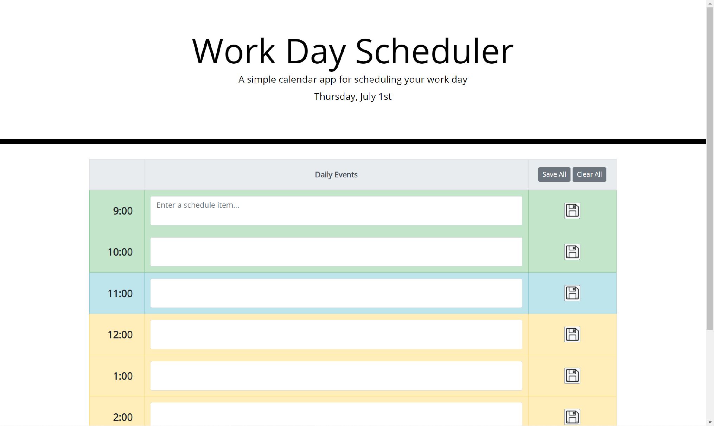

# Work Day Scheduler

## Deployed Link: [https://kkolyvek.github.io/work-day-scheduler/](https://kkolyvek.github.io/work-day-scheduler/)

### Description:

This site allows users to prepare for their 9-5 workday by writing down events expected to happen. Users can then save their notes, which will add the content to the browser's local storage (so that information persists on refresh). Additionally, the hours of the day are color coded to reflect whether they are in the past, present, or the future.

### Resources:

The site was made using Bootstrap, moment.js, and jQuery.

### Site Preview:

